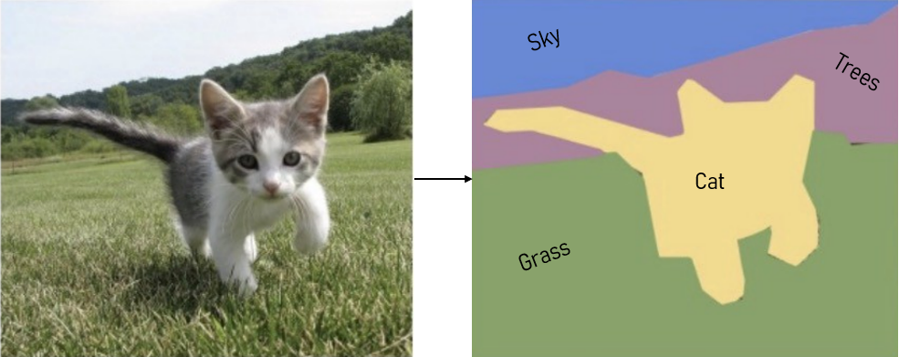

U-net is a must know architecture for semantic segmentation given its 
impact on this task when it was released. This study is focused on 
U-Net architecture, we will implement it on PyTorch from scratch and 
segment cars from the background from the carvana dataset.

## Big thanks to Aladdin Persson

Aladdin's content has helped me a lot in my learning process. This
post is my study of his [
video on U-net](https://youtu.be/IHq1t7NxS8k), and I
could not recommend his content enough if you want to get better at
deep learning.

## Semantic Segmentation

Semantic segmentation, or image segmentation, is the task of 
clustering parts of an image together which belong to the same object 
class. It is a form of pixel-level prediction because each pixel in 
an image is classified according to a category. 



This definition was taken from [papers with 
code](https://paperswithcode.com/task/semantic-segmentation), I consider it 
concise and clear.

# Model

There are a few differences in our model compared to the original 
paper. We will use padded convolutions in order to simplify the data 
loading process and we will also add batch normalization which did 
not exist back when the paper was published. 

As always the code is available at my 
[github](https://github.com/n3ry7/studies/tree/main/semantic_segmentation_unet).

Let us start by the imports:
```python
import torch
import torch.nn as nn
import torchvision.transforms.functional as TF
```

There is this pattern of double convolutions that repeats itself 
throughout the network, so we will define a class for this:

```python
class DoubleConv(nn.Module):
    def __init__(self, in_channels, out_channels):
        super(DoubleConv, self).__init__()
        self.conv = nn.Sequential(
            nn.Conv2d(in_channels, out_channels, 3, 1, 1, bias=False),
            nn.BatchNorm2d(out_channels),
            nn.ReLU(inplace=True),
            nn.Conv2d(out_channels, out_channels, 3, 1, 1, bias=False),
            nn.BatchNorm2d(out_channels),
            nn.ReLU(inplace=True),
        )

    def forward(self, x):
        return self.conv(x)
```

This applies 2 3x3 convolutions with padding of 1, batch 
normalization and ReLu as activation function.

Let us write our U-Net class:
```python
class UNET(nn.Module):
    def __init__(
            self, in_channels=3, out_channels=1, features=[64, 128, 256, 512],
    ):
        super(UNET, self).__init__()
        self.ups = nn.ModuleList()
        self.downs = nn.ModuleList()
        self.pool = nn.MaxPool2d(kernel_size=2, stride=2)

        # Down part of UNET
        for feature in features:
            self.downs.append(DoubleConv(in_channels, feature))
            in_channels = feature

        # Up part of UNET
        for feature in reversed(features):
            self.ups.append(
                nn.ConvTranspose2d(
                    feature*2, feature, kernel_size=2, stride=2,
                )
            )
            self.ups.append(DoubleConv(feature*2, feature))

        self.bottleneck = DoubleConv(features[-1], features[-1]*2)
        self.final_conv = nn.Conv2d(features[0], out_channels, kernel_size=1)
```
The model has methods for the down path of the "U" and then the up, 
also a pooling method. So the down part applies the double 
convolution following the feature list, the up part is the same but 
with the list reversed.

Then finally we have the bottleneck for the bottom part and the final 
convolution.

And the forward method:
```python
    def forward(self, x):
        skip_connections = []

        for down in self.downs:
            x = down(x)
            skip_connections.append(x)
            x = self.pool(x)

        x = self.bottleneck(x)
        skip_connections = skip_connections[::-1]

        for idx in range(0, len(self.ups), 2):
            x = self.ups[idx](x)
            skip_connection = skip_connections[idx//2]

            if x.shape != skip_connection.shape:
                x = TF.resize(x, size=skip_connection.shape[2:])

            concat_skip = torch.cat((skip_connection, x), dim=1)
            x = self.ups[idx+1](concat_skip)

        return self.final_conv(x)
```
The forward apply the defined methods in the required order with the 
skip connections for resizes.
# Dataset

We will use the carvana dataset and segment cars from the background. 
This dataset is available at 
[kaggle](https://www.kaggle.com/c/carvana-image-masking-challenge).

Our imports:
```python
import os
from PIL import Image
from torch.utils.data import Dataset
import numpy as np
```

And the dataset class:
```python
class CarvanaDataset(Dataset):
    def __init__(self, image_dir, mask_dir, transform=None):
        self.image_dir = image_dir
        self.mask_dir = mask_dir
        self.transform = transform
        self.images = os.listdir(image_dir)

    def __len__(self):
        return len(self.images)

    def __getitem__(self, index):
        img_path = os.path.join(self.image_dir, self.images[index])
        mask_path = os.path.join(self.mask_dir, self.images[index].replace(".jpg", "_mask.gif"))
        image = np.array(Image.open(img_path).convert("RGB"))
        mask = np.array(Image.open(mask_path).convert("L"), dtype=np.float32)
        mask[mask == 255.0] = 1.0

        if self.transform is not None:
            augmentations = self.transform(image=image, mask=mask)
            image = augmentations["image"]
            mask = augmentations["mask"]

        return image, mask

```
 The *init* gets the arguments of image directories and optional 
 transformation.

 All dataset classes must have a method to return its lenght, here it 
 simply *len(self.images)*.

 Get item returns a numpy array of the image and mask, the paths 
 come from the *self.images* list and for the mask path you just need 
 to replace the end of the string. *Image* from pillow loads the 
 image that is converted to a *numpy* array, the mask is converted to 
 ones and zeros. And in case transform is not None we apply 
 augmentations on the images.

That is it for the dataset.

# Train

Let's see how the training goes. 
```python
import torch
import albumentations as A
from albumentations.pytorch import ToTensorV2
from tqdm import tqdm
import torch.nn as nn
import torch.optim as optim
from model import UNET
from utils import (
    load_checkpoint,
    save_checkpoint,
    get_loaders,
    check_accuracy,
    save_predictions_as_imgs,
)
```
Here are the imports, we will define the utils later.

```python
# Hyperparameters etc.
LEARNING_RATE = 1e-4
DEVICE = "cuda" if torch.cuda.is_available() else "cpu"
BATCH_SIZE = 32
NUM_EPOCHS = 3
NUM_WORKERS = 2
IMAGE_HEIGHT = 160  # 1280 originally
IMAGE_WIDTH = 240  # 1918 originally
PIN_MEMORY = True
LOAD_MODEL = False
TRAIN_IMG_DIR = "./carvana-image-masking-challenge/train/"
TRAIN_MASK_DIR = "./carvana-image-masking-challenge/train_masks/"
VAL_IMG_DIR = "./carvana-image-masking-challenge/val/"
VAL_MASK_DIR = "./carvana-image-masking-challenge/val_masks/"
```

Define hyperparameters and paths, notice that the image dimensions 
are reduced in order to train faster, if you want higher precision 
keep the original dimensions.

```python
def train_fn(loader, model, optimizer, loss_fn, scaler):
    loop = tqdm(loader)

    for batch_idx, (data, targets) in enumerate(loop):
        data = data.to(device=DEVICE)
        targets = targets.float().unsqueeze(1).to(device=DEVICE)

        # forward
        with torch.cuda.amp.autocast():
            predictions = model(data)
            loss = loss_fn(predictions, targets)

        # backward
        optimizer.zero_grad()
        scaler.scale(loss).backward()
        scaler.step(optimizer)
        scaler.update()

        # update tqdm loop
        loop.set_postfix(loss=loss.item())
```

This function trains for one epoch. We are using tqdm to show a 
progress bar. In the loop we load the image and mask to device, 
unsqueeze the mask since it has only one dimensions, get the model 
output and compute the loss. Then in the backward, the optimizer 
calculates the step from the loss and gradient and update wights.

Now we define a main function for training:
```python
def main():
    train_transform = A.Compose(
        [
            A.Resize(height=IMAGE_HEIGHT, width=IMAGE_WIDTH),
            A.Rotate(limit=35, p=1.0),
            A.HorizontalFlip(p=0.5),
            A.VerticalFlip(p=0.1),
            A.Normalize(
                mean=[0.0, 0.0, 0.0],
                std=[1.0, 1.0, 1.0],
                max_pixel_value=255.0,
            ),
            ToTensorV2(),
        ],
    )

    val_transforms = A.Compose(
        [
            A.Resize(height=IMAGE_HEIGHT, width=IMAGE_WIDTH),
            A.Normalize(
                mean=[0.0, 0.0, 0.0],
                std=[1.0, 1.0, 1.0],
                max_pixel_value=255.0,
            ),
            ToTensorV2(),
        ],
    )
```
We start applying augmentations in the inputs.
```python
    model = UNET(in_channels=3, out_channels=1).to(DEVICE)
    loss_fn = nn.BCEWithLogitsLoss()
    optimizer = optim.Adam(model.parameters(), lr=LEARNING_RATE)

    train_loader, val_loader = get_loaders(
        TRAIN_IMG_DIR,
        TRAIN_MASK_DIR,
        VAL_IMG_DIR,
        VAL_MASK_DIR,
        BATCH_SIZE,
        train_transform,
        val_transforms,
        NUM_WORKERS,
        PIN_MEMORY,
    )

    check_accuracy(val_loader, model, device=DEVICE)
    scaler = torch.cuda.amp.GradScaler()

    if LOAD_MODEL:
        load_checkpoint(torch.load("my_checkpoint.pth.tar"), model)
```
Then we define the model, loss function optimizer and start the 
dataloader.

```python
    for epoch in range(NUM_EPOCHS):
        train_fn(train_loader, model, optimizer, loss_fn, scaler)

        # save model
        checkpoint = {
            "state_dict": model.state_dict(),
            "optimizer":optimizer.state_dict(),
        }
        save_checkpoint(checkpoint)

        # check accuracy
        check_accuracy(val_loader, model, device=DEVICE)

        # print some examples to a folder
        save_predictions_as_imgs(
            val_loader, model, folder="saved_images/", device=DEVICE
        )
```

Finally, we loop the train function, save a checkpoint in each epoch, 
check accuracy and save the prediction images.

# Utils

We will not go in detail about the utils file. It is pretty straight 
forward, only the accuracy check could use a bit more explanation. If 
you have any questions or want me to explain this part a bit better, 
don't hesitate to ask in the comments.

# Results

I trained the model for only 3 epochs and got an accuracy of 99.16%.

Here are the segmentation masks of the first 32 itens in the 
validation set.


