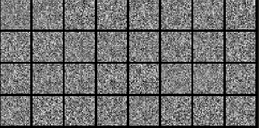
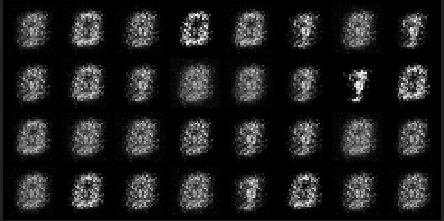
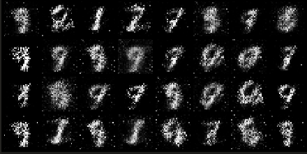
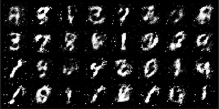

This is the first post of a series of GANs studies that I intend to post. This one is
about exploring GANs concepts, I will just define simple architectures for the generator
and discriminator and see how they perform on MNIST dataset.

The image above is a diagram of how this network operates, this image was taken from Arham
Khan's medium blog.

## Big thanks to Aladdin Persson

Aladdin's content has helped me a lot in my learning process. This
post is basically my study of his [first
video](https://youtu.be/OljTVUVzPpM) on his GANs playlist, and I
could not recommend his content enough if you want to get better at
deep learning.

# What are GANs?

> "GANs is the most exciting idea in the last 10 years in machine 
learning". 
> _Yann LeCun_

GAN stands for generative adversarial network. And I will not go in
depth on the description of how it works or its applications, you can
check Alladin's [introduction](https://youtu.be/OXWvrRLzEaU) to the
theme.

In summary, a GAN countains 2 networks, a generator and a
discriminator, and the generator is trying to fool the discriminator
with its outputs while the discriminator is trying to detect fake
inputs from the generator apart from original data.

They are adversarial nets because clearly they are competing with
each other and forcing each other to do better at its task in the
process.

## The Value Function

The discriminator and generator are playing the following minimax
game with the value function $ V(G,D) $:

$$ min_{G}max_{D}V(G,D)= logD(x)+log(1-D(G(x)))$$

So we are going to use the BCEloss (binary cross entropy) to compute
the loss function that maximizes V in respect to D and minimizes V in
respect to G. This post is more of a hands on, rather than a deep
dive in GANs theory, this [video](https://youtu.be/Gib_kiXgnvA)
explains the math behind and why use BCEloss here.

# Our Network Architecture

We are going to use the same simple architecture both for the
discriminator and the generator, which is 2 fully connected layers.
This code is available on my 
[github](https://github.com/n3ry7/studies/blob/main/GANs/simpleg_gan/simplegan.py),
let's get our hands dirty.

Here are the imports we need:

```python
import torch
import torch.nn as nn
import torch.optim as optim
import torchvision
import torchvision.datasets as datasets
from torch.utils.data import DataLoader
import torchvision.transforms as transforms
from torch.utils.tensorboard import SummaryWriter

```
And here is the discriminator:

```python
class Discriminator(nn.Module):
    def __init__(self, in_features):
        super().__init__()
        self.disc = nn.Sequential(
            nn.Linear(in_features, 128),
            nn.LeakyReLU(0.01),
            nn.Linear(128, 1),
            nn.Sigmoid(),
        )

    def forward(self, x):
        return self.disc(x)

```

Pretty straight forward, 2 fully connected layers with 128 neurons,
leaky ReLU as activation after the first layer and sigmoid on the
output. Note that we have only one channel as output of the
discriminator, it tells the input is either fake or real.

Now the generator:

```python
class Generator(nn.Module):
    def __init__(self, z_dim, img_dim):
        super().__init__()
        self.gen = nn.Sequential(
            nn.Linear(z_dim, 256),
            nn.LeakyReLU(0.01),
            nn.Linear(256, img_dim),
            nn.Tanh(),  # normalize inputs to [-1, 1] so make outputs [-1, 1]
        )

    def forward(self, x):
        return self.gen(x)
```

Similar to the discriminator, it is a 2 layer fully connected
network, but here we have 256 neurons on each layer and Tanh on the
output. The input size is determined by the noise we will use and the
output size is the size of the flattened image we want to output.

# Hyperparameters and DataLoader

GANs are quite sensible to hyperparameters, just be aware of this if
you experiment with other values. Here are the ones used in this
code, notice that 28 by 28 is the size of MNIST input.

```python
device = "cuda" if torch.cuda.is_available() else "cpu"
lr = 3e-4
z_dim = 64
image_dim = 28 * 28 * 1  # 784
batch_size = 32
num_epochs = 50
```
Here we initialize the networks, create some fixed noise that will be
used to visualize the output in the training process and define the
transform to normalize the input data, since the generator also
normalize its output.

```python
disc = Discriminator(image_dim).to(device)
gen = Generator(z_dim, image_dim).to(device)
fixed_noise = torch.randn((batch_size, z_dim)).to(device)
transforms = transforms.Compose(
    [transforms.ToTensor(), transforms.Normalize((0.5,), (0.5,)),]
)

```

We create the discriminator and generator objects, a fixed noise for
data visualization with tensorboard during training and also define
the transformation we will use.

```python
dataset = datasets.MNIST(root="dataset/", transform=transforms, download=True)
loader = DataLoader(dataset, batch_size=batch_size, shuffle=True)
opt_disc = optim.Adam(disc.parameters(), lr=lr)
opt_gen = optim.Adam(gen.parameters(), lr=lr)
criterion = nn.BCELoss()
writer_fake = SummaryWriter(f"logs/fake")
writer_real = SummaryWriter(f"logs/real")
step = 0
```

The code above define the dataset used, which is MNIST, apply the
transform to have values between -1 and 1, define the optimizer for
both discriminator and generator and also create the writers for
tensorboard.

# Training Script

This is the trickiest part of the code, so bare with me.

The first part is looping through batches and epochs, the regular
stuff, notice we flatten the images to a one dimensional array.

```python
for epoch in range(num_epochs):
    for batch_idx, (real, _) in enumerate(loader):
        real = real.view(-1, 784).to(device)
        batch_size = real.shape[0]


```

And now the discriminator train:
```python
        ### Train Discriminator: max log(D(x)) + log(1 - D(G(z)))
        noise = torch.randn(batch_size, z_dim).to(device)
        fake = gen(noise)
        disc_real = disc(real).view(-1)
        lossD_real = criterion(disc_real, torch.ones_like(disc_real))
        disc_fake = disc(fake).view(-1)
        lossD_fake = criterion(disc_fake, torch.zeros_like(disc_fake))
        lossD = (lossD_real + lossD_fake) / 2
        disc.zero_grad()
        lossD.backward(retain_graph=True)
        opt_disc.step()

```

We start generating fake images from noise with the generator, then
proceed to compute the discriminator of the real inputs. We compute
the loss of the first term and second term respectively using the
criterion, zero the gradient, apply the back propagation and
increment the optimizer. An important detail is that we retain graph
in backward propagation because we will use the discriminator of fake
in the next loss calculation.

```python
        ### Train Generator: min log(1 - D(G(z))) <-> max log(D(G(z))
        output = disc(fake).view(-1)
        lossG = criterion(output, torch.ones_like(output))
        gen.zero_grad()
        lossG.backward() 
	opt_gen.step()
```

There is a numerical trick used in this code, it is better to
maximize rather than minimize a function, so we will maximize
$log(D(G(z)))$ which is the same as minimize $log(1-D(G(z)))$.
Our output is the result of discriminator of fake input, loss is
calculated using criterion, we zero the gradient and calculate back
propagation, then finally step the optimizer.

```python
 if batch_idx == 0:
     print(
         f"Epoch [{epoch}/{num_epochs}] Batch {batch_idx}/{len(loader)} \
               Loss D: {lossD:.4f}, loss G: {lossG:.4f}"
     )

     with torch.no_grad():
         fake = gen(fixed_noise).reshape(-1, 1, 28, 28)
         data = real.reshape(-1, 1, 28, 28)
         img_grid_fake = torchvision.utils.make_grid(fake, normalize=True)
         img_grid_real = torchvision.utils.make_grid(data, normalize=True)

         writer_fake.add_image(
             "Mnist Fake Images", img_grid_fake, global_step=step
         )
         writer_real.add_image(
             "Mnist Real Images", img_grid_real, global_step=step
         )
         step += 1
```

The last part is visualization with tensorboard.

# Results

Here we see the output of the generator on the first fifth, tenth and fiftieth epoch
respectively.

*1st epoch*
*5th epoch*
*10th epoch*
*50th epoch*

We can see the results are getting better each epoch, but are not accurate even after 50
epochs of training. These results are quite impressive considering how simple our
architecture is and they do prove the concepts of GANs, the generator is indeed learning
how to produce handwritten digits.

Next we will try a more complex architecture and compare the results.
