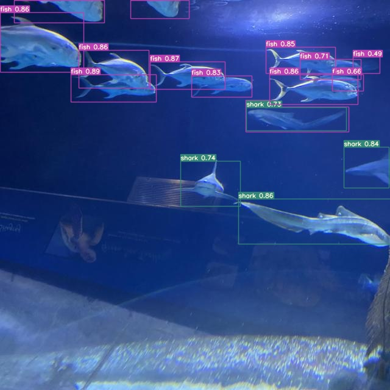

# Introduction

Object detection is one of the most important tasks in computer 
vision and YOLO is a family of networks dedicated to this task. 
Recently on July 22 of this year the new version YOLOv7 was 
released and it surpassed all object detectors in both speed and 
accuracy. So learning how to use this network is a must.

For this tutorial we are gonna run the training and inference on our 
local machine using the GPU and I am currently using Linux, but this 
should be easy to follow on Windows or MAC too. It is done mostly
in Python using the YOLOv7 
[repo](https://github.com/WongKinYiu/yolov7).

You can also check my video following this tutorial on YouTube.




# Virtual Environment 

Let's get started! 

You could skip this part and install all the Python packages on your 
local environment, but I highly suggest that you create virtual 
environments for each project so you avoid requirements conflicts.

You could use conda, but I will use the python module venv.

```bash
python -m venv yolov7
```

And then activate your virtual env.
```bash
source yolov7/bin/activate
```


# Clone the yolov7 Repository 

```bash
git clone https://github.com/WongKinYiu/yolov7
cd yolov7
```


## Install Requirements

You could edit the requirements.txt file and comment out dependencies 
that you will not use. But for now I recommend you leave it as is.

```bash
pip install -r requirements.txt
```

This could take a while depending on your internet bandwidth so be 
patient.


# Dataset

We are gonna need a dataset to train. If you have one already you 
could use it, or maybe you can create one yourself annotating images 
with a tool like labelme. But for this tutorial I would rather use 
one that is publicly available so you could follow exactly the same 
steps.

In this 
[link](https://universe.roboflow.com/brad-dwyer/aquarium-combined/dataset/1) you 
can find the aquarium dataset in roboflow, you just need to register 
and then you can download the data. Select the "YOLO v7 PyTorch" 
option as the export format and download the "640 aug". 

Extract the dataset, I placed it in the yolov7/data/aquarium. You can 
place it anywhere you like, you just have to get the folder path to 
edit the data.yaml file.

Mine looks like this:

```text
train: /home/nery/yolov7/data/aquarium/train/images/
val: /home/nery/yolov7/data/aquarium/valid/images/

nc: 7

names: ['fish', 'jellyfish', 'penguin', 'puffin', 'shark', 
'starfish', 'stingray']
```

# Training

For training you need to specify some arguments: the number of 
workers, batch size, data.yaml file, initial weights and a file with 
hyperparameters info. 

My GPU is an RTX 3060, so I had to adjust batch size and number of 
workers, you can tweak these if you have multiple GPUs.

```bash
train.py --workers 4 --device 0 --batch-size 8 --data 
data/aquarium.yaml --img 640 640 --cfg cfg/training/yolov7.yaml 
--weights yolov7.pt --name yolov7-aquarium --hyp 
data/hyp.scratch.p5.yaml
```

This will take a while, you can check the precision of model during 
each epoch.


# Results

I only let it train for about 20 epochs, the precision was not 
improving much already on each epoch. It ended with about 80% mAP@.5 
and 45% mAP@0.5:0.95.

Here is a sample detection:


